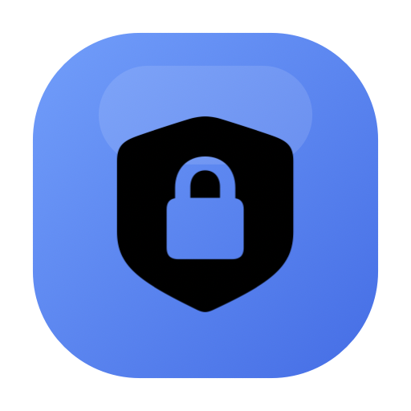

<p align="center">
  
</p>

<h1 align="center">Lock</h1>

<p align="center">
  <strong>A native macOS menu bar app for password-protecting selected apps.</strong>
</p>

<p align="center">
  
  
  
</p>

Lock watches the apps you choose and places a password prompt in front of them when they launch, become active, or reappear. The protected app is hidden until you unlock it with your Lock password or Touch ID.

Lock is designed as a lightweight local privacy layer for a personal Mac. It is not a system-level security boundary, parental-control system, encryption tool, or replacement for locking your macOS account.

## Download

Download the latest DMG from GitHub Releases:

```text
https://github.com/zohaibarsalan/lock/releases/latest
```

Open the downloaded DMG, drag `Lock.app` into `Applications`, then launch Lock from `/Applications`.

Because Lock is a menu bar app, it does not stay in the Dock after launch. Look for the lock icon in the macOS menu bar.

## Requirements

- macOS 14 or later
- Accessibility permission
- Screen Recording permission

Lock asks for the macOS permissions it needs from the app settings screen.

## First-Time Setup

1. Download the latest DMG from [GitHub Releases](https://github.com/zohaibarsalan/lock/releases/latest).
2. Open the DMG.
3. Drag `Lock.app` into `Applications`.
4. Launch `Lock.app`.
5. Open Lock from the menu bar.
6. Go to `Settings`.
7. Grant `Accessibility` permission.
8. Grant `Screen Recording` permission.
9. Set your Lock password.
10. Go to `App List`.
11. Turn on protection for the apps you want to lock.

## Features

- Menu bar app with no persistent Dock icon
- Searchable list of installed apps
- Per-app protection toggles
- Password unlock
- Touch ID unlock on supported Macs
- Protected app hiding while locked
- Lock overlay positioned around the protected app's window
- Quit option from the lock screen for a locked app
- Accessibility and Screen Recording permission checks
- Launch at login support
- Recent activity log for lock, unlock, settings, and permission events

## Launch At Login

Lock can start automatically when you sign in.

1. Open Lock from the menu bar.
2. Go to `Settings`.
3. Enable `Launch Lock at login`.

Launch at login works best after Lock has been moved into `/Applications`.

## Privacy And Storage

Lock stores all data locally on your Mac.

- Password data is stored in Keychain.
- The raw password is not stored.
- Protected app selections are stored in user defaults.
- Activity logs are in-memory app session logs and are cleared when the app quits.
- No network service is used by the app.

## Permissions

Lock needs macOS privacy permissions to work reliably.

### Accessibility

Used to inspect app windows and coordinate lock behavior around other apps.

### Screen Recording

Used so macOS allows Lock to discover visible windows and frames of other apps. Lock does not upload or transmit screen data.

If either permission is missing, Lock may fail to detect an app window, place the overlay incorrectly, or show the protected app before it can hide it.

## Troubleshooting

### Lock does not appear in the Dock

That is expected. Lock is configured as a menu bar app. Use the menu bar icon to open the app list, settings, logs, or quit Lock.

### A protected app is not locking

- Make sure a Lock password has been set.
- Make sure the app is enabled in `App List`.
- Re-check Accessibility and Screen Recording permissions.
- Quit and relaunch the protected app.
- Quit and relaunch Lock.

### The app list is missing an app

- Click `Refresh` in `App List`.
- Make sure the app exists in one of the scanned locations.
- Move the app to `/Applications` if it lives somewhere unusual.

### The lock overlay appears in the wrong place

Some apps use custom windowing or report unusual window frames. Re-check permissions first, then quit and reopen both Lock and the protected app.

### Touch ID is missing

Touch ID only appears on the lock screen when macOS reports biometric authentication as available. Use password unlock on Macs without Touch ID or when Touch ID is unavailable.

### Permissions look granted but locking is unreliable

macOS can hold stale privacy state after app updates or reinstalling the app. Remove and re-add Lock in Accessibility and Screen Recording, then restart Lock.

## Known Issues And Limitations

- AltTab for macOS and similar third-party app switchers can still show the protected app's window preview in their app switcher UI.
- Stage Manager may briefly flash a protected app when switching apps without unlocking it first.
- A protected app can appear briefly during launch, activation, space changes, or macOS permission prompts before Lock receives the system event and hides it again.
- Mission Control, app switchers, screenshot tools, screen sharing tools, and other system-level or third-party window utilities may expose previews that Lock cannot fully suppress.
- Full-screen apps, apps in another Space, and apps managed by Stage Manager may not always produce a perfectly positioned lock overlay.
- Apps with custom window systems, games, Electron apps, or apps with multiple transient windows may report incomplete or unusual window geometry.
- Once an app is unlocked, that running process stays unlocked until it quits. Relaunching the app creates a new process and requires unlocking again.

## For Developers

These steps are for local development, testing, and publishing releases. Users should install Lock from the DMG on the [Releases](https://github.com/zohaibarsalan/lock/releases/latest) page.

### Local Build

Build the app bundle:

```bash
./scripts/build_app.sh
```

Output:

```text
dist/Lock.app
```

Run the local app bundle:

```bash
./scripts/run_app.sh
```

Install the local build into `/Applications`:

```bash
./scripts/install_app.sh
```

### Build The DMG

Build the release DMG:

```bash
./scripts/build_dmg.sh
```

Output:

```text
dist/release/Lock-0.1.0.dmg
dist/release/Lock-0.1.0.dmg.sha256
```

The DMG contains `Lock.app` and an `Applications` shortcut.

### App Version

Version metadata lives in:

```text
scripts/app_metadata.sh
```

Before each release:

1. Update `APP_VERSION`, such as `0.1.1`.
2. Increment `APP_BUILD`.
3. Update the version badge and DMG examples in this README if the version changes.
4. Build the DMG with `./scripts/build_dmg.sh`.

The build script writes these values into `Lock.app/Contents/Info.plist`:

- `CFBundleShortVersionString` from `APP_VERSION`
- `CFBundleVersion` from `APP_BUILD`

### GitHub Release Checklist

1. Build the DMG:

```bash
./scripts/build_dmg.sh
```

2. Verify the generated files:

```bash
ls -lh dist/release
shasum -a 256 dist/release/Lock-0.1.0.dmg
```

3. Commit the release changes:

```bash
git add README.md scripts/app_metadata.sh scripts/build_app.sh scripts/build_dmg.sh
git commit -m "Prepare Lock 0.1.0 release"
```

4. Tag and push the release:

```bash
git tag v0.1.0
git push origin main
git push origin v0.1.0
```

5. Open GitHub Releases:

```text
https://github.com/zohaibarsalan/lock/releases/new
```

6. Select tag `v0.1.0`, title the release `Lock 0.1.0`, and upload:

```text
dist/release/Lock-0.1.0.dmg
dist/release/Lock-0.1.0.dmg.sha256
```

7. Add release notes, include the SHA-256 checksum, and publish.

For public distribution, the recommended release artifact is a Developer ID signed and notarized DMG. The current scripts produce a local ad-hoc signed DMG suitable for testing and private distribution.
